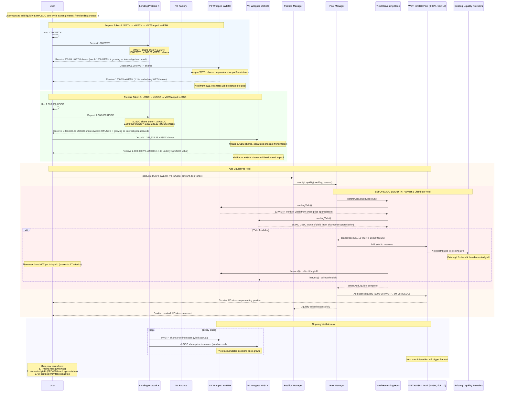

```mermaid
sequenceDiagram
    participant User
    participant LendingProtocolX as Lending Protocol X
    participant VIIFactory as VII Factory
    participant VIIWrapperWETH as VII Wrapped xWETH
    participant VIIWrapperUSDC as VII Wrapped xUSDC
    participant PositionManager as Position Manager
    participant PoolManager as Pool Manager
    participant YieldHook as Yield Harvesting Hook
    participant Pool as WETH/USDC Pool (0.05%, tick=10)
    participant ExistingLPs as Existing Liquidity Providers

    Note over User: User wants to add liquidity ETH/USDC pool while earning interest from lending protocol x

    %% Step 1: Prepare Token A (WETH -> xWETH -> VII Wrapped xWETH)
    rect rgb(240, 248, 255)
        Note over User, VIIWrapperWETH: Prepare Token A: WETH → xWETH → VII Wrapped xWETH
        User->>User: Has 1000 WETH
        User->>LendingProtocolX: Deposit 1000 WETH
        Note over LendingProtocolX: xWETH share price = 1.1 ETH<br/>1000 WETH = 909.09 xWETH shares
        LendingProtocolX-->>User: Receive 909.09 xWETH shares (worth 1000 WETH + growing as interest gets accrued)
        User->>VIIWrapperWETH: Deposit 909.09 xWETH shares
        Note over VIIWrapperWETH: Wraps xWETH shares, separates principal from interest
        VIIWrapperWETH-->>User: Receive 1000 VII-xWETH (1:1 to underlying WETH value)
        Note over VIIWrapperWETH: Yield from xWETH shares will be donated to pool
    end

    %% Step 2: Prepare Token B (USDC -> xUSDC -> VII Wrapped xUSDC)
    rect rgb(240, 255, 240)
        Note over User, VIIWrapperUSDC: Prepare Token B: USDC → xUSDC → VII Wrapped xUSDC
        User->>User: Has 2,000,000 USDC
        User->>LendingProtocolX: Deposit 2,000,000 USDC
        Note over LendingProtocolX: xUSDC share price = 1.5 USDC<br/>2,000,000 USDC = 1,333,333.33 xUSDC shares
        LendingProtocolX-->>User: Receive 1,333,333.33 xUSDC shares (worth 2M USDC + growing as interest gets accrued)
        User->>VIIWrapperUSDC: Deposit 1,333,333.33 xUSDC shares
        Note over VIIWrapperUSDC: Wraps xUSDC shares, separates principal from interest
        VIIWrapperUSDC-->>User: Receive 2,000,000 VII-xUSDC (1:1 to underlying USDC value)
        Note over VIIWrapperUSDC: Yield from xUSDC shares will be donated to pool
    end

    %% Step 3: Add Liquidity Through Position Manager
    rect rgb(255, 248, 240)
        Note over User, Pool: Add Liquidity to Pool
        User->>PositionManager: addLiquidity(VII-xWETH, VII-xUSDC, amount, tickRange)
        PositionManager->>PoolManager: modifyLiquidity(poolKey, params)

        %% Step 4: Yield Harvesting Hook Execution (BEFORE adding liquidity)
        rect rgb(255, 240, 240)
            Note over PoolManager, ExistingLPs: BEFORE ADD LIQUIDITY: Harvest & Distribute Yield
            PoolManager->>YieldHook: beforeAddLiquidity(poolKey)

            YieldHook->>VIIWrapperWETH: pendingYield()
            VIIWrapperWETH-->>YieldHook: 12 WETH worth of yield (from share price appreciation)

            YieldHook->>VIIWrapperUSDC: pendingYield()
            VIIWrapperUSDC-->>YieldHook: 15,000 USDC worth of yield (from share price appreciation)

            alt Yield Available
                YieldHook->>PoolManager: donate(poolKey, 12 WETH, 15000 USDC)
                PoolManager->>Pool: Add yield to reserves
                Pool-->>ExistingLPs: Yield distributed to existing LPs
                Note over ExistingLPs: Existing LPs benefit from harvested yield
                Note over User: New user does NOT get this yield (prevents JIT attacks)

                YieldHook->>VIIWrapperWETH: harvest() - collect the yield
                YieldHook->>VIIWrapperUSDC: harvest() - collect the yield
            end

            YieldHook-->>PoolManager: beforeAddLiquidity complete
        end

        %% Step 5: Actual Liquidity Addition
        PoolManager->>Pool: Add user's liquidity (1000 VII-xWETH, 2M VII-xUSDC)
        Pool-->>User: Receive LP tokens representing position
        PoolManager-->>PositionManager: Liquidity added successfully
        PositionManager-->>User: Position created, LP tokens received
    end

    %% Step 6: Ongoing Yield Accrual
    rect rgb(248, 248, 255)
        Note over VIIWrapperWETH, Pool: Ongoing Yield Accrual
        loop Every block
            LendingProtocolX->>VIIWrapperWETH: xWETH share price increases (yield accrual)
            LendingProtocolX->>VIIWrapperUSDC: xUSDC share price increases (yield accrual)
            Note over VIIWrapperWETH, VIIWrapperUSDC: Yield accumulates as share price grows
        end

        Note over Pool: Next user interaction will trigger harvest
        Note over User: User now earns from:<br/>1. Trading fees (Uniswap)<br/>2. Harvested yield (ERC4626 vault appreciation)<br/>3. VII protocol may take small fee
    end

```
