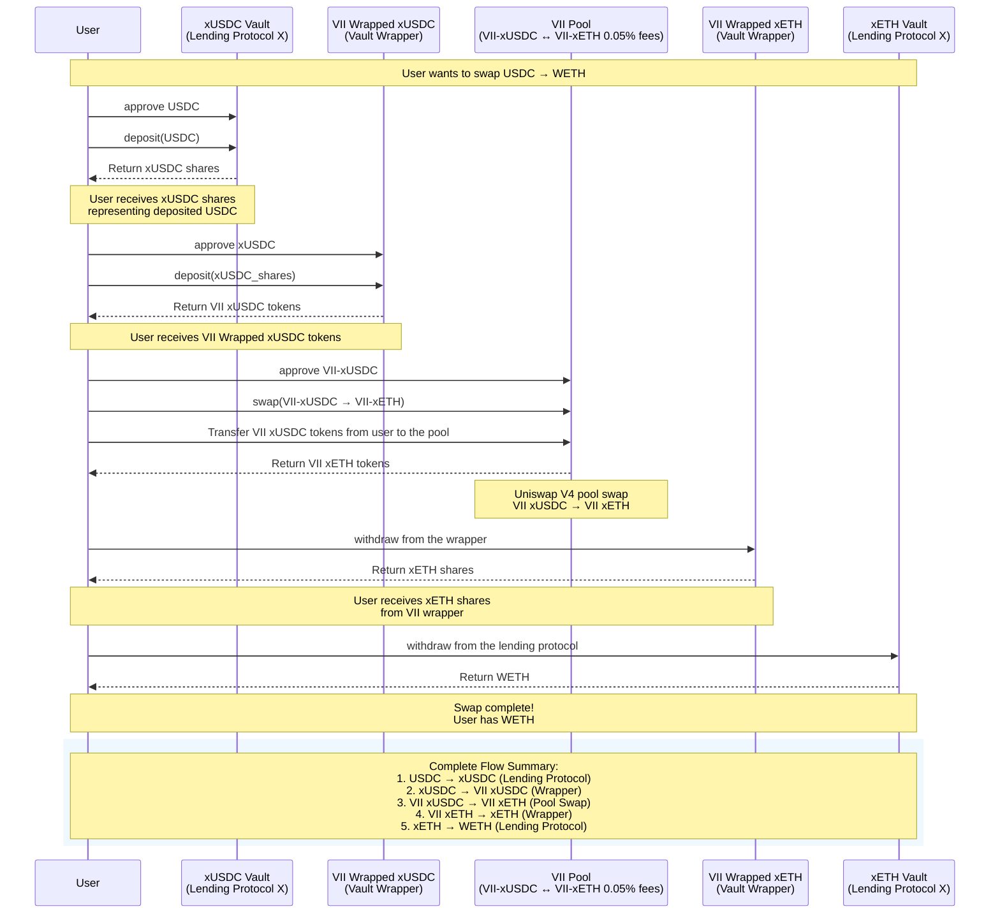

# VII Wrapper Swap Flow: USDC → WETH

```mermaid
sequenceDiagram
    participant User
    participant xUSDC as xUSDC Vault<br/>(Lending Protocol X)
    participant VIIxUSDC as VII Wrapped xUSDC<br/>(Vault Wrapper)
    participant Pool as VII Pool<br/>(VII-xUSDC ↔ VII-xETH 0.05% fees)
    participant VIIxETH as VII Wrapped xETH<br/>(Vault Wrapper)
    participant xETH as xETH Vault<br/>(Lending Protocol X)

    Note over User, xETH: User wants to swap USDC → WETH

    %% Step 1: Deposit USDC into lending protocol
    User->>xUSDC: approve USDC
    User->>xUSDC: deposit(USDC)
    xUSDC-->>User: Return xUSDC shares
    Note over User, xUSDC: User receives xUSDC shares<br/>representing deposited USDC

    %% Step 2: Wrap xUSDC into VII wrapper
    User->>VIIxUSDC: approve xUSDC
    User->>VIIxUSDC: deposit(xUSDC_shares)
    VIIxUSDC-->>User: Return VII xUSDC tokens
    Note over User, VIIxUSDC: User receives VII Wrapped xUSDC tokens

    %% Step 3: Swap in VII pool
    User->>Pool: approve VII-xUSDC
    User->>Pool: swap(VII-xUSDC → VII-xETH)
    User->>Pool: Transfer VII xUSDC tokens from user to the pool
    Pool-->>User: Return VII xETH tokens
    Note over Pool: Uniswap V4 pool swap<br/>VII xUSDC → VII xETH

    %% Step 4: Withdraw from VII xETH to get xETH
    User->>VIIxETH: withdraw from the wrapper
    VIIxETH-->>User: Return xETH shares
    Note over User, VIIxETH: User receives xETH shares<br/>from VII wrapper

    %% Step 5: Withdraw WETH from lending protocol
    User->>xETH: withdraw from the lending protocol
    xETH-->>User: Return WETH
    Note over User, xETH: Swap complete!<br/>User has WETH

    %% Summary box
    rect rgb(240, 248, 255)
        Note over User, xETH: Complete Flow Summary:<br/>1. USDC → xUSDC (Lending Protocol)<br/>2. xUSDC → VII xUSDC (Wrapper)<br/>3. VII xUSDC → VII xETH (Pool Swap)<br/>4. VII xETH → xETH (Wrapper)<br/>5. xETH → WETH (Lending Protocol)
    end
```
